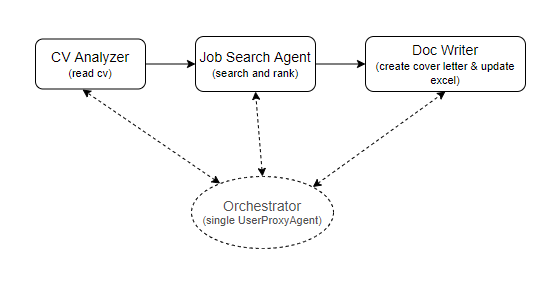

### Contributors:
1. Indika Perera        : Indika.Perera@oulu.fi
2. Chaminda Hewa Hakuru : Kumara.Hewa@student.oulu.fi
# JobSpinner

An AI-powered job search and application platform built with [AG2](https://github.com/ag2ai/ag2) (AutoGen) framework. JobSpinner accepts the CV and read it to build candidate's profile, searches the web for matching live job postings, scores them against candidate's profile, select most maching 3 jobs. Finally writes tailored cover letters for selected jobs, and logs every application to an Excel tracker.

---

## How it works

The application runs on three AI agents orchestrated by executor in sequence. orchestrator is a UserProxyAgent that starts the conversation where 2nd and 3rd agents get the previous agnet's summarized output as the input. Each agent has to provide the summarized result to the next agent to process.




| Agent | Description |
|---|---|
| **CV Analyzer** | Reads the CV in PDF or TEXT format and extracts a structured profile (skills, experience, education, preferences) |
| **Job Search Agent** | Searches LinkedIn, Indeed, Glassdoor and Finnish job boards for matching postings; scores each one against candidate's profile |
| **Doc Writer** | Writes a tailored cover letter for the top 3 jobs and logs them to an Excel file |

Output files are saved to the `output/` folder.

---

## Requirements

- Python 3.10+
- An OpenAI-compatible API proxy (e.g. OpenRouter, LiteLLM, or direct OpenAI)
- A [Tavily](https://tavily.com) API key for web search

---

## Installation

```bash
# 1. Clone the repository
git clone <repo-url>
cd JobSpinner

# 2. Create and activate a virtual environment
python -m venv .venv

# Windows
.venv\Scripts\activate

# macOS / Linux
source .venv/bin/activate

# 3. Install dependencies
pip install ag2 openai tavily-python python-docx openpyxl pypdfium2 python-dotenv
```

---

## Configuration

Create a `.env` file in the project root:

```env
API_PROXY=https://your-openai-compatible-proxy/v1
TAVILY_API_KEY=tvly-xxxxxxxxxxxxxxxxxxxx
```

The model is configured in [config.py](config.py) — default is `openai/gpt-4.1-mini`. Change the `model` field there if you want to use a different model.

---

## Usage

### Full pipeline
CV file (PDF or TXT) has to copy into /test folder in the project root with the name `sample_cv.pdf`, then run the system with following command

```bash
python main.py
```

The pipeline will:
1. Analyze the CV
2. Search for at least 5 matching jobs
3. Score and rank them
4. Write cover letters and update the job tracker (excel)

Results are saved to `output/`:
- `CoverLetter_<CompanyName>.docx` — one per job
- `job_applications.xlsx` — running log of all applications

### Running individual tests

```bash
# Test only CV analysis
python test/test_cv_analyzer.py

# Test only job search
python test/test_job_search.py

# Test the full pipeline end-to-end
python test/test_pipeline.py
```

---

## Project structure

```
JobSpinner/
├── agents/
│   ├── cv_analizer_agent.py     # CV analysis agent
│   ├── job_search_agent.py      # Job search + scoring agent
│   └── doc_writer_agent.py      # Cover letter + Excel writer agent
├── tools/
│   ├── file_reader.py           # PDF / TXT reader
│   ├── web_search.py            # job search wrapper
│   ├── job_ranker.py            # Score and job match
│   └── document_writer.py       # write .docx and .xlsx helpers
├── test/
│   ├── sample_cv.pdf            # Place CV here
│   ├── test_cv_analyzer.py
│   ├── test_job_search.py
│   ├── test_job_matcher.py
│   └── test_pipeline.py
├── output/                      # Generated files (created automatically)
├── config.py                    # LLM and API configuration
├── main.py                      # Entry point
└── .env                         # API keys (not committed to GitHub)
```

---

## Scoring Stratergy

Each job is scored by [`tools/job_ranker.py`](tools/job_ranker.py) across five dimensions:

| Dimension | Weight |
|---|---|
| Skill match | 45% |
| Role match | 35% |
| Experience match | 10% |
| Language match | 5% |
| Location match | 5% |

Jobs scoring below 0.1 are filtered out. The top 3 are passed to the Doc Writer Agent.

---

## Notes

- The pipeline uses a single `Orchestrator` agent as the executor for all tool calls, following the AG2 Sequential Chats pattern.
- Cover letters are limited to one A4 page and never hallucinate information not present in CV.
- The Excel tracker prevents duplicate entries for the same company + role combination.
